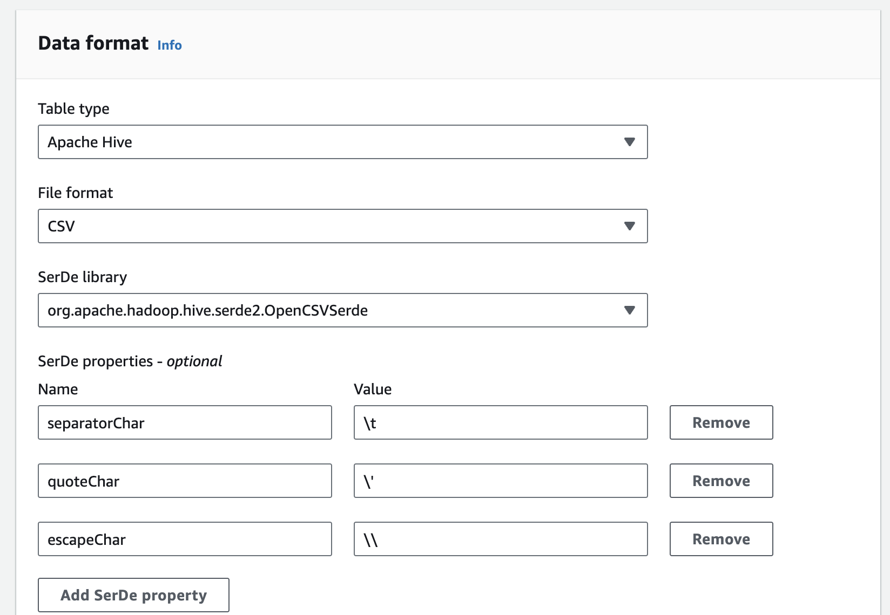

# NC Beauty

No code for this as it's mostly done through the console. Just some things to be aware of.

## Task 1:

When creating the tables I'd recommend doing it through the Athena console rather than the Glue console. Under the hood Athena tables seem to have some kind of default setting that omits dodgy data. Whereas a table created by Glue does not.

When querying the influencers table initially the output omits the dodgy follower count data:


Querying the table created in the Glue console on the other hand:


---

Query for getting influencer with higher than average followers:

```sql
SELECT *
FROM "athena_influencers_table"
WHERE followers > (
    SELECT avg(followers) from athena_influencers_table
);
```

## Task 2:

Creating the table was a bit of a mare. The instructions point you towards OpenCSVSerde which you can read about here: https://docs.aws.amazon.com/athena/latest/ug/csv-serde.html

You have to mess around with the SerDe parameters to make it work. I got it to work by removing the **quoteChar** as it was expecting all strings to have quotation marks. You can do this during table creation or retroactively remove the param in the Glue console:



Also:

This is the configuration needed to skip the first line:

```txt
"skip.header.line.count"="1"
```
