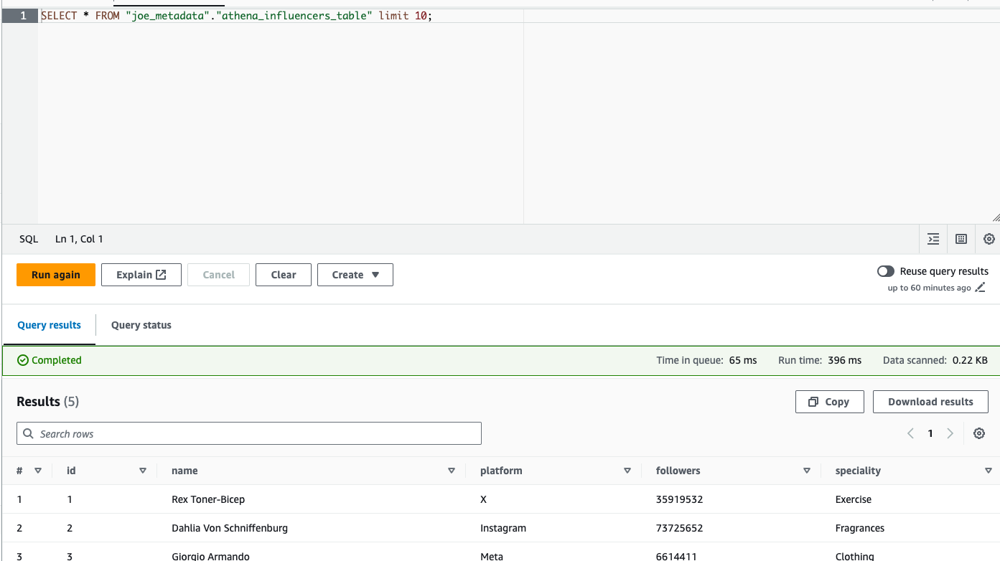
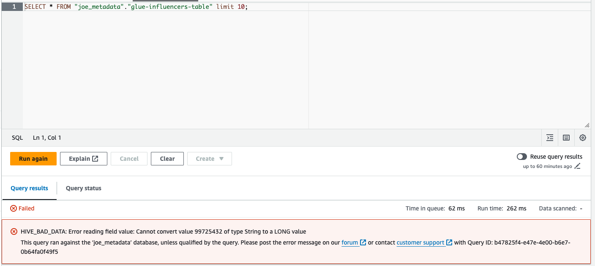
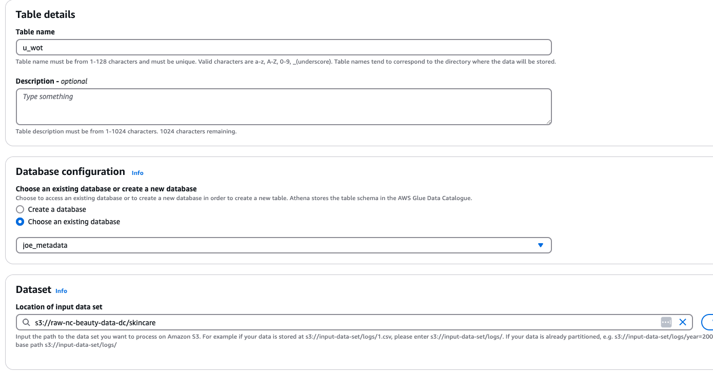
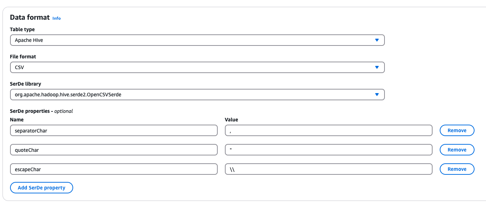
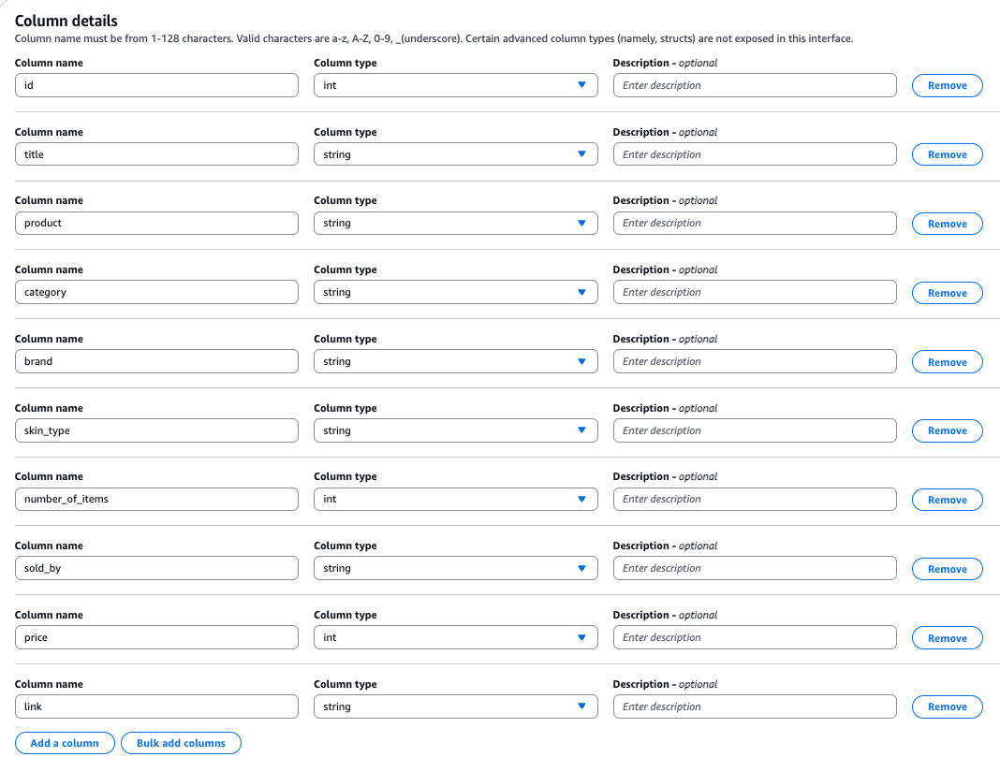
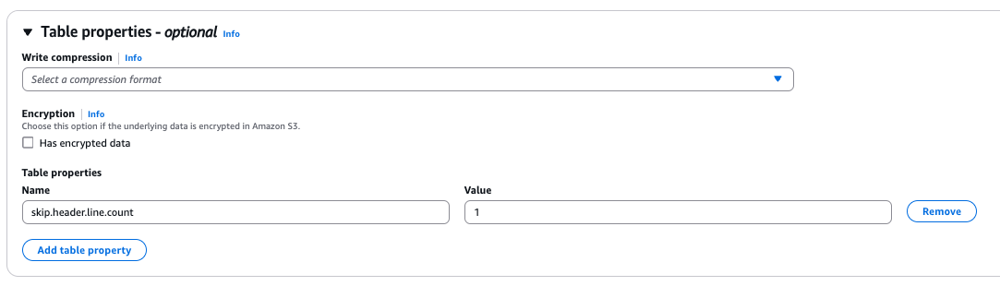
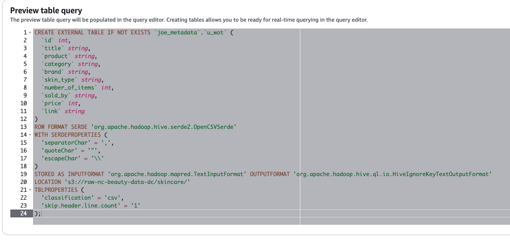

# NC Beauty

No code for this as it's mostly done through the console. Just some things to be aware of.

## Task 1:

When creating the tables I'd recommend doing it through the Athena console rather than the Glue console. Under the hood Athena tables seem to have some kind of default setting that omits dodgy data. Whereas a table created by Glue does not.

When querying the influencers table initially the output omits the dodgy follower count data:



Querying the table created in the Glue console on the other hand:



---

Query for getting influencer with higher than average followers:

```sql
SELECT *
FROM "athena_influencers_table"
WHERE followers > (
    SELECT avg(followers) from athena_influencers_table
);
```

## Task 2:

**I'd really recommend doing this with the Athena `Create Table` UI as it makes things easier. Doing it with Glue can lead to problems that are an arse to debug**

Creating the table was a bit of a mare. The instructions point you towards OpenCSVSerde which you can read about here: https://docs.aws.amazon.com/athena/latest/ug/csv-serde.html

This is the configuration needed to skip the first line:

```txt
"skip.header.line.count"="1"
```

### Screenshots Showing the Steps taken on Athena to create the table:

**STEP 1:**

Create table from existing metabase configuration - link to s3 bucket



**STEP 2:**

Specify file format and SerDe library (OpenCSVSerDe). Change the `seperatorChar`, `quoteChar` and `escapeChar` properties.



**STEP 3:**

Specify column names and data types.



**STEP 4:**

In optional table properties specify that to want to skip the header.



**STEP 5:**

This should produce a DDL statement shown in the preview box at the bottom. You can click the create table button or copy and paste it into the Athena editor.


